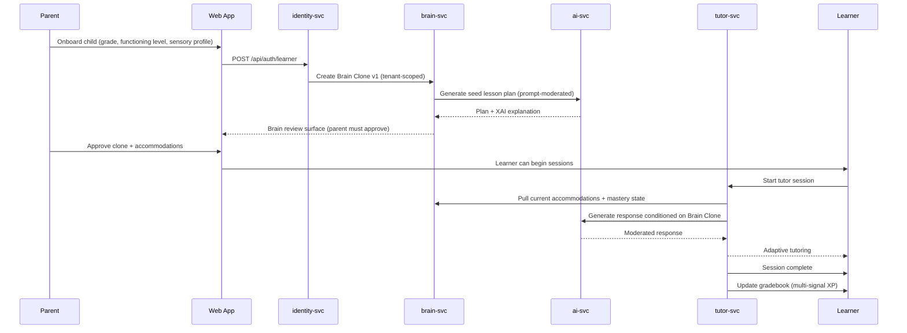

# AIVO v3 Architecture Overview

AIVO is a multi-tenant K-12 learning platform centered on a per-learner **Brain Clone** —
a structured behavioral and academic profile that conditions every AI-generated lesson,
tutor message, and accommodation recommendation.

## Service Topology

```mermaid
flowchart LR
  subgraph Clients
    Web[apps/web — Next.js]
    Mobile[apps/mobile — Expo]
    Marketing[apps/marketing — Next.js]
  end

  subgraph Edge
    Identity[identity-svc<br/>auth, MFA, sessions]
  end

  subgraph Core
    Brain[brain-svc<br/>Python + FastAPI<br/>profile, clone, XAI]
    Assessment[assessment-svc<br/>stage tests, mastery]
    AI[ai-svc<br/>LLM gateway, Langfuse]
    Learning[learning-svc<br/>sessions, gradebook, XP]
    Tutor[tutor-svc<br/>conversational tutors]
  end

  subgraph Family
    Family[family-svc]
    Engagement[engagement-svc]
    Comms[comms-svc]
  end

  subgraph Operations
    Billing[billing-svc]
    I18n[i18n-svc]
    Integrations[integrations-svc<br/>Clever, Classroom, ClassLink, Canvas]
    Admin[admin-svc]
    Status[status-page-svc]
    Research[research-svc]
  end

  Web --> Identity
  Mobile --> Identity
  Identity --> Brain
  Identity --> Learning
  Identity --> Tutor
  Identity --> Family
  Brain --> AI
  Tutor --> AI
  Tutor --> Brain
  Learning --> Brain
  Learning --> Tutor
  Assessment --> Brain
  Family --> Comms
  Status --> Comms
  Integrations --> Identity
```

All services share a single Postgres cluster with logical schema boundaries; cross-service
calls go through HTTP (Fastify on Node, FastAPI on Python). Service-to-service calls use a
shared `INTERNAL_SERVICE_TOKEN` plus `x-internal-service` header. End-user requests carry
a JWT (Bearer or HttpOnly cookie). The `@aivo/observability` package provides structured
logging plus an `x-request-id` hook so a single request can be traced across services.

## Primary Data Flow: Parent → Brain → Learner



## Key Design Decisions

### Brain Clone (per learner, per tenant)
The Brain Clone is the single source of truth for a learner's accommodations,
functioning level, sensory profile, mastery vector, and behavioral signals. Every
AI generation pulls the current clone state. Parents must explicitly **approve** the
initial clone and any structural changes (XAI surface shows what changed and why).

### Five-tier Functioning Level Model
Learners are placed on a 1–5 scale spanning emerging-foundational through
advanced-independent. The model drives lesson modality (visual/audio/text mix),
prompt complexity, scaffolding density, and the threshold for mastery-gated
advancement. The level is not a label shown to learners; it conditions content.

### Explainable AI (XAI) Everywhere
No AI decision goes opaque. Every brain update, accommodation suggestion, and
mastery judgment carries a structured explanation: signals, weights, prior beliefs,
counterfactuals. Parents and reviewers see this on the brain-review surface.

### Multi-tenant Isolation
Tenants are organizations (districts, schools, family pods). Every learner-scoped
route enforces `requireLearnerAccess(req, learnerId)` which validates that the
caller's tenant matches the learner's tenant (or the caller is an internal service
with a valid token). See `docs/security-architecture.md`.

### Safety-first Pipeline
Content moderation runs **before** prompt submission and **after** generation.
Failures fall back to a safe template, never to the raw model output. The safety
gate is non-bypassable from any client-facing path.

## API Reference
Every Fastify service mounts Swagger UI at `/docs` (e.g. `http://localhost:3005/docs`
for learning-svc). The Python brain-svc mounts FastAPI's interactive docs at
`/docs` on port 3002. There is no consolidated cross-service OpenAPI bundle; the
authentication contract is documented in `docs/security-architecture.md` and
contracts for cross-service calls live in `packages/contracts`.
